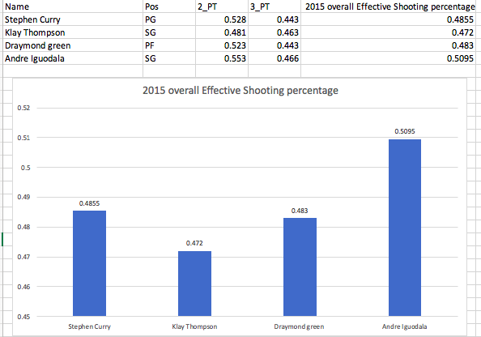
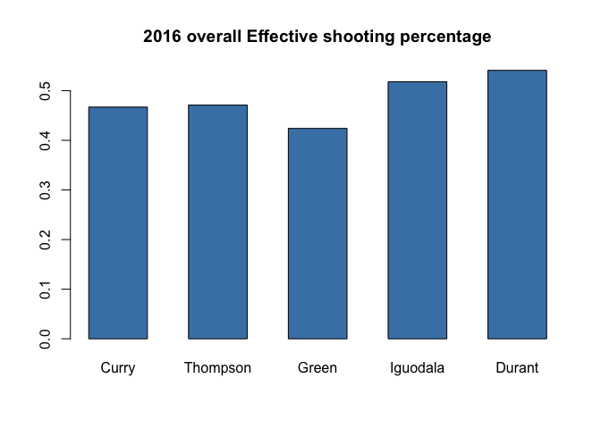
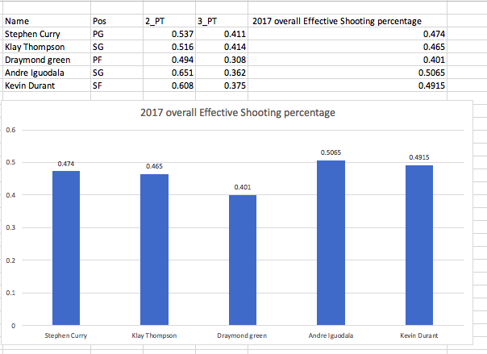
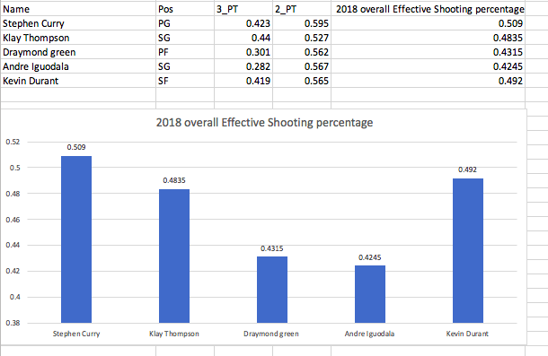

workout01
================
Jiani Song
3/9/2019


``` r
# 5.1
library(readr)
library(dplyr)
```

    ## Warning: package 'dplyr' was built under R version 3.5.2

    ## 
    ## Attaching package: 'dplyr'

    ## The following objects are masked from 'package:stats':
    ## 
    ##     filter, lag

    ## The following objects are masked from 'package:base':
    ## 
    ##     intersect, setdiff, setequal, union

``` r
shots_data <- read.csv(file = "../data/shots-data.csv")
two_PT <-  filter(shots_data, shot_type == "2PT Field Goal")

two_PT %>%
   group_by(name) %>%
  summarise(
    total = length(name), 
    made = length(shot_made_flag[shot_made_flag == "shot_yes"]),
    perc_made = made / total) %>%
arrange(desc(perc_made))
```

    ## # A tibble: 5 x 4
    ##   name           total  made perc_made
    ##   <fct>          <int> <int>     <dbl>
    ## 1 Andre Iguodala   210   134     0.638
    ## 2 Kevin Durant     643   390     0.607
    ## 3 Stephen Curry    563   304     0.540
    ## 4 Klay Thompson    640   329     0.514
    ## 5 Graymond Green   346   171     0.494

``` r
three_PT <-  filter(shots_data, shot_type == "3PT Field Goal")
three_PT %>%
   group_by(name) %>%
  summarise(
    total = length(name), 
    made = length(shot_made_flag[shot_made_flag == "shot_yes"]),
    perc_made = made / total) %>%
arrange(desc(perc_made))
```

    ## # A tibble: 5 x 4
    ##   name           total  made perc_made
    ##   <fct>          <int> <int>     <dbl>
    ## 1 Klay Thompson    580   246     0.424
    ## 2 Stephen Curry    687   280     0.408
    ## 3 Kevin Durant     272   105     0.386
    ## 4 Andre Iguodala   161    58     0.360
    ## 5 Graymond Green   232    74     0.319

``` r
shots_data %>%
  group_by(name) %>%
  summarise(
    total = length(name), 
    made = length(shot_made_flag[shot_made_flag == "shot_yes"]),
    perc_made = made / total) %>%
arrange(desc(perc_made))
```

    ## # A tibble: 5 x 4
    ##   name           total  made perc_made
    ##   <fct>          <int> <int>     <dbl>
    ## 1 Kevin Durant     915   495     0.541
    ## 2 Andre Iguodala   371   192     0.518
    ## 3 Klay Thompson   1220   575     0.471
    ## 4 Stephen Curry   1250   584     0.467
    ## 5 Graymond Green   578   245     0.424

``` r
sshot_data<- shots_data %>%
  group_by(name) %>%
  summarise(
    total = length(name), 
    made = length(shot_made_flag[shot_made_flag == "shot_yes"]),
    perc_made = made / total) %>%
arrange(desc(perc_made))
sshot_data
```

    ## # A tibble: 5 x 4
    ##   name           total  made perc_made
    ##   <fct>          <int> <int>     <dbl>
    ## 1 Kevin Durant     915   495     0.541
    ## 2 Andre Iguodala   371   192     0.518
    ## 3 Klay Thompson   1220   575     0.471
    ## 4 Stephen Curry   1250   584     0.467
    ## 5 Graymond Green   578   245     0.424

Beginning of the end of the GSW dynasty?
========================================

### Glorious History of GSW

##### Introduction: During the season of 2014-2015, Golden State Warriors claimed their first championship after four decades. Stephen Curry came up to the stage and impressed the whole world. During the season of 2015-2016, Warriors suffered met a few challenges and lost the NBA Finals to Cleveland Cavaliers. Fortunately, they renewed their vigor and with the help of excellent player Kevin Durant, this team broke another record in the history of NBA by winning 207 games during a three-year period by the end of 2018. However, in this season 2018-2019, things didn’t go well. Many people are guessing whether it will be the end of the GSW dynasty due to their lack of success during the regular season. My report is going to analyze the effective shooting percentage of five capable members of GSW in recent years and observe the changes in their condition, then make prediction on whether they will still win this year's NBA Finals.

##### Motivation: By observing GSW members’ effective shooting percentage, we could predict on their condition trend and make our own conclusion on whether they are in their best status to claim the consecutive triple win in this season’s NBA Finals.

##### Background: In the 2014-2015 season, the Golden States Warriors got their first championship in almost four decades. This was probably the best season for them since Jordan’s era. They made through the final four consecutive seasons and got 67 wins during two of them. Over the course of four years’ training, they won more regular season games than any other team in the history of the NBA. Their perseverance finally translated to the final championship. After this season, they became the first team in the NBA history to finish with the top ranking defense and maintained their status for a couple of games in the playoffs. They maintained their perseverance and never gave it up. In 2015-2016, they went through a little downfall and lost Game 7 to Cleveland Cavaliers that played with more focus and better energy. The coach Kerr said he thought they were going to win. Things just didn’t go as well as they expected. This season became the low ebb for the Warriors. Fortunately, after this decline, with the help of the additional power forward Kevin Durant, they claimed a the championship for both seasons from 2016-2018. Within short four years, they claim the NBA crown for three times. During this long and difficult period of time, they displayed a kind of dominance within the league, which was very rare in the history of NBA. After multiple rises, here comes another fall. In this season, the Warriors’ lack of success in the regular season cast doubt on whether it is the end of GSW dynasty. Injuries are one of the most significant reasons. Besides team members, their coach Steve Kerr also suffering from multiple complications after back surgeries. Both Stephen Curry and Draymond Green missed couple games and Klay Thompson and Kevin Durant didn’t shoot well. Many of these important members are not in their best condition. Therefore, many people are worried about the future of Warriors.

##### Statistics: The followings are the effective shooting percentages of five capable Golden State Warriors members. The data I used came from foxsports. The members I analyzed are Stephen Curry, Klay Thompson, Draymond Green, Andre Iguodala and Kevin Durant, who joined the team in 2016. I'm going to compare the differences between each player for each year. After analysing the differences within each year, a total trend for these 5 members' performances will be generated. By observing this trend I can make a guess on whether or not GSW will claim the triple consecutive win in this year.



``` r
stat_2016 <- c(0.467,0.471,0.424,0.518,0.541)
names(stat_2016)=c("Stephen Curry","Klay Thompson","Graymond Green","Andre Iguodala","Kevin Durant")
barplot(stat_2016, main = "2016 overall Effective shooting percentage", col = "steel blue")
```



 

##### Analysis: Starting from the year 2015, four members showed approximately equal ability in the effective shooting. There was not many differences between them. The range was only 2%. However, in the year of 2016, there was a clear difference between members. The difference increased to 7%. Observing more detailly, the difference was due to Draymond Green, whose score dropped from 0.483 to 0.424. During this year, Kevin Durant was signed into the Warriors. He impressed everyone with a very high score of 0.541. His score was the highest among all the members. When it came to 2017, the range of difference increased to 10.55%. During this year, Draymond kept going down to 0.401 and Kevin Durant also went down to 0.4915, but the differences between members were shortened. However, last year, the statistics fluctuated drastically. Andre Iguodala was not in good condition and his score dropped 8%, which made team members' difference enlarge again. Comparing the trend of the recent years' effective shooting scores, only Stephen Curry and Klay Thompson have a little increase, the rest three members all declined a lot.

##### Conclusion: Only based on these data, I made a conclusion that the performance of the warriors has a downward trend. They are not in good condition in the shooting. This made sense, as stated earlier in the background, some of the members' injuries may affect their performance. Or maybe, as the age grows up, they are less flexible than before. Another reason must be taken into account was the coach of GSW Steve Kerr suffering from multiple complications of back surgeries. His absence might have an influence on team members' performance. Only taking the given statistics into consideration, they are less likely to win the NBA Finals this year. This might be an indication that the GSW dynasty is over. However, their decline cannot be assumed by a single reason. It must be caused by many correlated reasons.Therefore, more research and analysis need to be done to consider their future trend comprehensively. Besides, there's no certainty in the competition.

##### Reference:

Lee, Bruce Y. “Warriors Coach Steve Kerr Shows Why You Should Be Wary Of Back Surgery.” Forbes, 29 Apr. 2017, www.forbes.com/sites/brucelee/2017/04/29/warriors-coach-steve-kerr-shows-why-you-should-be-wary-of-back-surgery/\#62df281e7ec0.

Pesta, Tony. “The Rise and Fall of the Golden State Warriors Dynasty.” Bluemanhoop, Jan. 2019, bluemanhoop.com/2018/12/31/the-rise-and-fall-of-the-golden-state-warriors-dynasty/2/.

Strauss, Ethan Sherwood. “2015-16 NBA Preview: The Warriors Are Gonna Be Awesome.” FiveThirtyEight, fivethirtyeight.com/features/nba-golden-state-warriors-preview/.

##### Statistics Reference: (for data in the pictures)

<https://www.teamrankings.com/nba/player-stat/efg-percentage>

<https://www.foxsports.com/nba/golden-state-warriors-team-stats?season=2018&category=SHOOTING&time=0>
